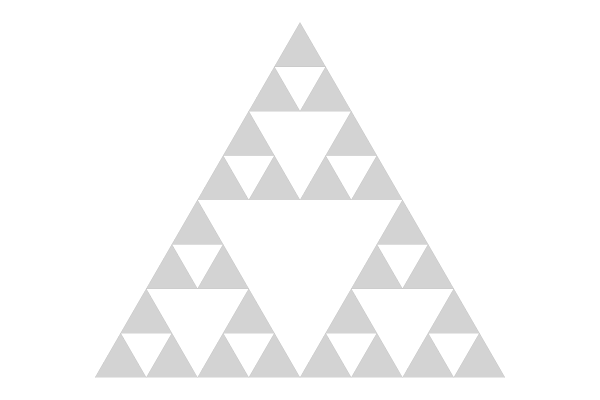
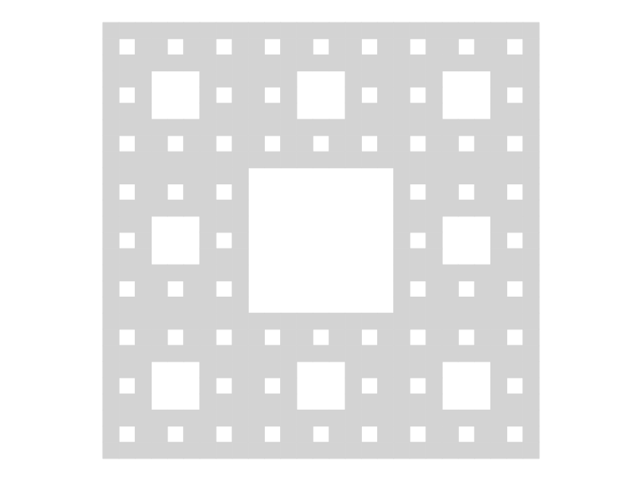

# Sierpinski

Code for drawing Sierpinski's triangle and carpet.

## Main Functions

The functions `triangle_pic` and `carpet_pic` generate Sierpinski's triangle and carpet, respectively. They take an optional integer parameter that determines how deeply we apply recursion to generate the figure. 

This is the output of `triangle_pic(3)`:

This is the output of `carpet_pic(3)`:

